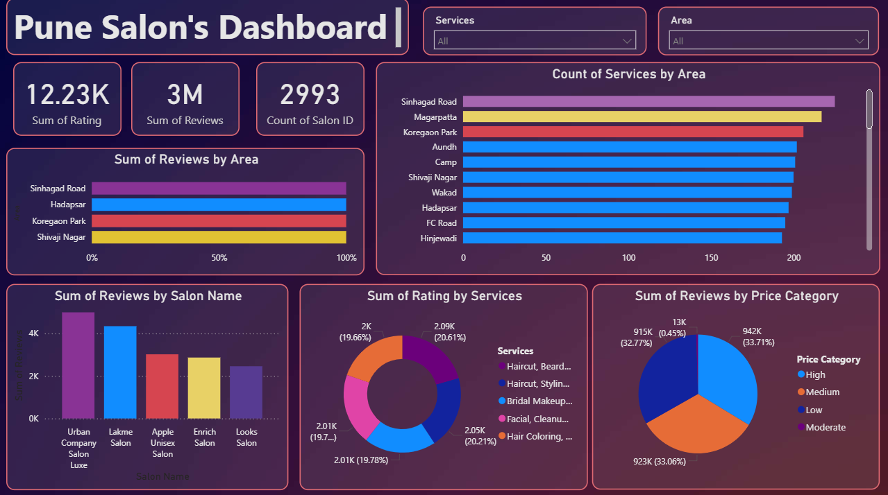
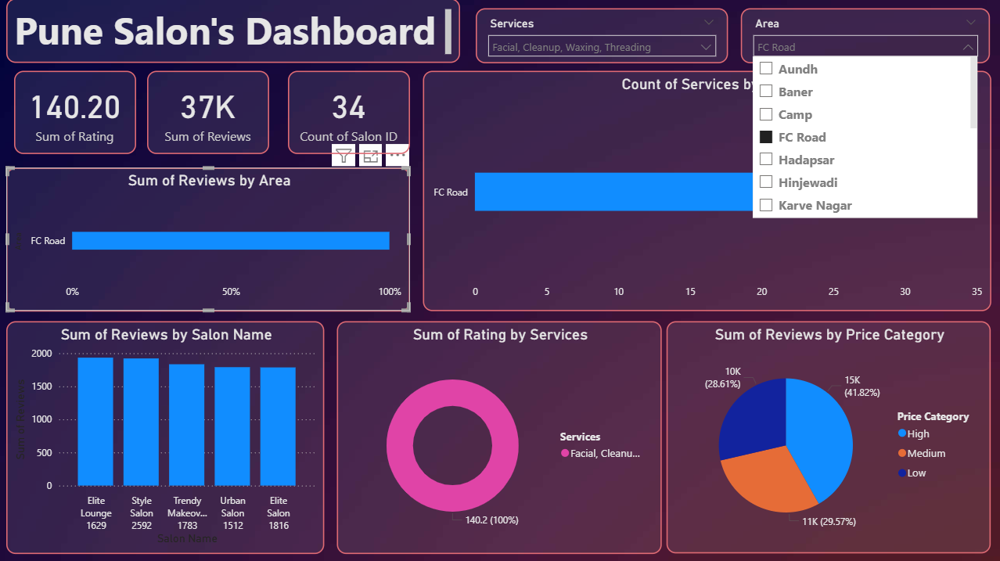
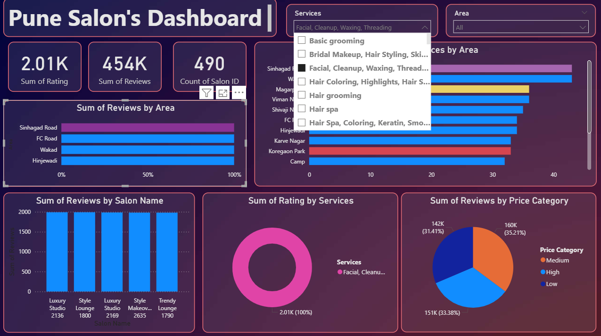
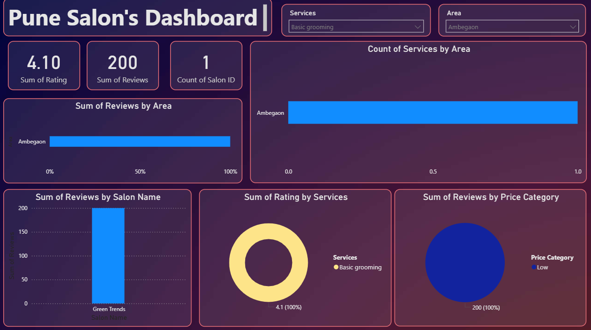

# 💇‍♀️ Pune Salons Dashboard – Power BI

An interactive **Power BI data analytics dashboard** developed to analyze salon businesses across Pune. The project focuses on transforming raw salon data into meaningful insights through **data cleaning, analysis, visualization, and interactive dashboard design**.

The dashboard helps understand salon distribution, ratings, pricing, services, locations, and other business-related patterns across Pune.

---

## 📊 Project Overview

The **Pune Salons Dashboard** provides a visual analysis of salon data collected from different areas of Pune.

The project follows a complete data analytics workflow:

**Raw Data → Data Cleaning → Data Analysis → Data Visualization → Interactive Power BI Dashboard**

The dashboard is designed to make salon-related information easier to understand and help identify patterns and trends in the Pune salon market.

---

## 🎯 Objectives

* Analyze salon businesses across different areas of Pune.
* Understand the distribution of salons by location.
* Analyze salon ratings and customer preferences.
* Compare salon pricing and services.
* Identify areas with a higher concentration of salons.
* Create interactive and visually appealing Power BI reports.
* Convert raw data into meaningful business insights.

---

## 🛠️ Tools & Technologies

* **Microsoft Power BI** – Dashboard development and visualization
* **Power Query** – Data cleaning and transformation
* **DAX** – Calculated measures and data analysis
* **Microsoft Excel / CSV** – Dataset handling
* **Data Visualization** – Charts, cards, maps and interactive visuals

---
## 📊 Dashboard Preview

### Dashboard 1
Original Dashboard:



### Dashboard 2
Dashboard with customised area choosed:



### Dashboard 3
Dashboard with customised services choosed:



### Dashboard 4
Dashboard with both customised area and services choosed:



---


## 📁 Repository Structure

```text
Pune-Salons-Dashboard/
│
├── Dataset/
│   └── Pune Salon Dataset
│
├── Images/
│   └── Dashboard screenshots
│
├── PowerBI File/
│   └── Pune Salons Dashboard.pbix
│
├── LICENSE
│
└── README.md
```

---

## 📌 Dashboard Features

### 🏙️ Salon Location Analysis

Analyze the distribution of salons across different areas of Pune and identify locations with higher salon availability.

### ⭐ Rating Analysis

Explore salon ratings to understand customer satisfaction and identify highly rated businesses.

### 💰 Price Analysis

Compare salon pricing and understand differences in service costs across various salons and locations.

### 💇 Service Analysis

Analyze the services offered by salons and identify commonly available services.

### 📊 Interactive Visualizations

The dashboard uses interactive Power BI visuals such as:

* KPI Cards
* Bar Charts
* Column Charts
* Pie / Donut Charts
* Maps
* Tables
* Slicers
* Filters

### 🔎 Interactive Filtering

Users can filter the dashboard based on different attributes such as:

* Location
* Salon
* Rating
* Price
* Services
* Other available dataset attributes

---

## 📈 Key Insights

The dashboard can be used to identify:

* Areas with a high concentration of salons.
* Distribution of salon ratings across Pune.
* Price variations between salons.
* Popular salon services.
* Relationship between salon location, ratings, and pricing.
* Business patterns across different Pune locations.

---

## 🧹 Data Preparation

Before creating the dashboard, the dataset was prepared for analysis by performing data preprocessing tasks such as:

* Removing duplicate records.
* Handling missing values.
* Standardizing categorical values.
* Cleaning location and salon names.
* Formatting numerical fields.
* Preparing data for Power BI visualization.
* Creating calculated measures where required.

---


## 🚀 How to Use

### 1. Clone the Repository

```bash
git clone https://github.com/Pallavi1904/Pune-Salons-Dashboard.git
```

### 2. Open the Project

Navigate to the downloaded project folder.

### 3. Open the Power BI File

Open the `.pbix` file from the **PowerBI File** folder using **Microsoft Power BI Desktop**.

### 4. Explore the Dashboard

Use the available:

* Filters
* Slicers
* Charts
* Maps
* KPI cards
* Interactive visualizations

to explore the Pune salon data.

---

## 💡 Business Use Cases

This dashboard can be useful for:

* Salon owners
* Business analysts
* Marketing teams
* Entrepreneurs
* Market researchers
* Customers comparing salons
* Businesses planning salon expansion

It can help businesses understand **market distribution, customer ratings, pricing patterns, and location-based opportunities**.

---

## 🔮 Future Enhancements

Possible future improvements include:

* Adding real-time salon data.
* Adding customer review sentiment analysis.
* Creating a salon recommendation system.
* Adding advanced geographic analysis.
* Integrating the dashboard with a live database.
* Adding time-based trend analysis.
* Developing predictive analytics for salon demand.
* Adding automated data refresh.

---

## 👩‍💻 Author

**Pallavi**

GitHub: [Pallavi1904](https://github.com/Pallavi1904)

---

## 📄 License

This project is licensed under the **MIT License**.

---

## ⭐ If You Like This Project

If you find this project useful or interesting, consider giving the repository a ⭐ on GitHub.

**Repository:**
https://github.com/Pallavi1904/Pune-Salons-Dashboard
